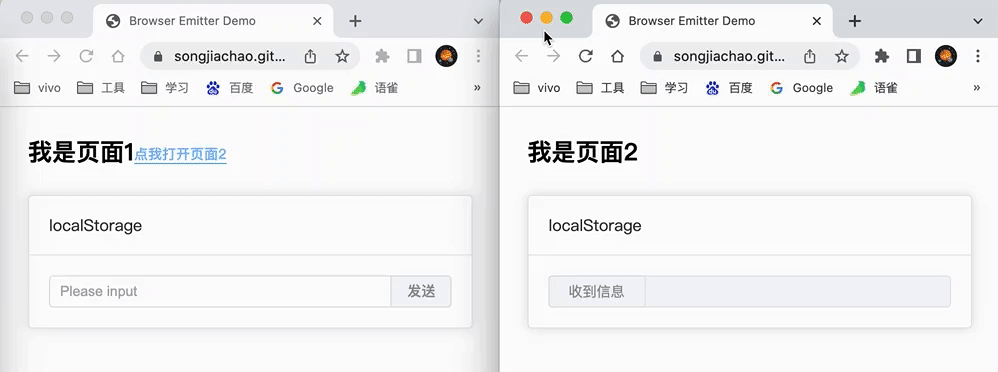

# browser-emitter
在网站开发过程中，经常会遇到两个页面进行通信的情况，这个项目是通过监听localStorage，实现多tab之间的通信。

## 示例
https://songjiachao.github.io/browser-emitter/examples/index.html




## 安装
--------------------------
`npm i browser-emitter`

or if you use yarn

`yarn add browser-emitter`

## 使用
```js
import BrowserEmitter from 'browser-emitter'

const be = new BrowserEmitter({
  prefix: 'be:'  // 可选，默认以'be:'开头的key，存储到localStorage里面
})

// 绑定事件
be.on('be:input1', (data) => {
  this.input1 = data
})

// 触发事件
be.emit('be:input1', this.input1)
```
